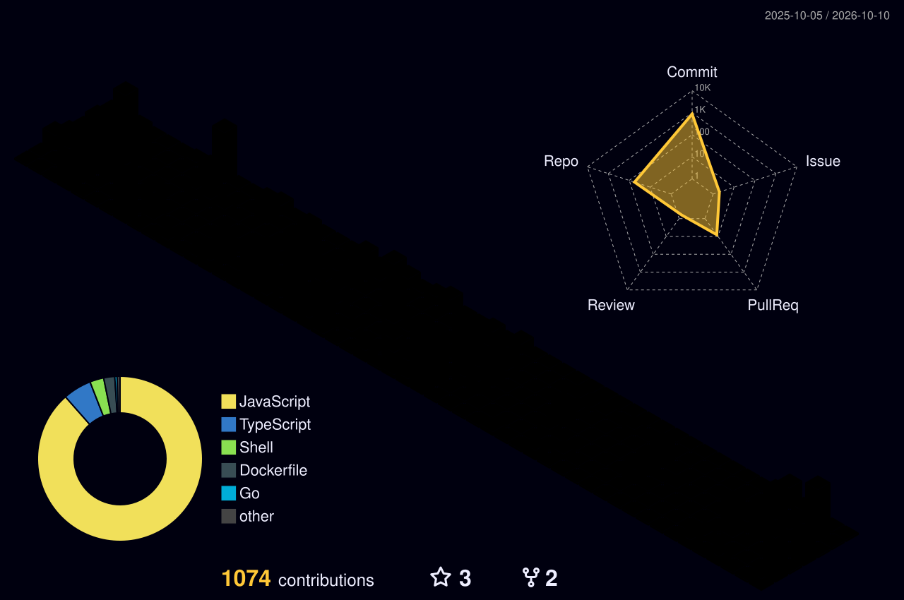

  <!-- 1. 打字机特效 -->
  <a href="https://github.com/XCQ0607">
    <picture>
      <source media="(prefers-color-scheme: dark)" srcset="https://all.chinax.nyc.mn/readme-typing-svg.herokuapp.com?font=Fira+Code&pause=1000&color=94A6FF&background=00000000&center=true&vCenter=true&width=435&lines=Hi+there!+I'm+XCQ0607;A+Student;A+Full+Stack+Developer;Open+Source+Enthusiast" />
      <source media="(prefers-color-scheme: light)" srcset="https://all.chinax.nyc.mn/readme-typing-svg.herokuapp.com?font=Fira+Code&pause=1000&color=0055AA&background=00000000&center=true&vCenter=true&width=435&lines=Hi+there!+I'm+XCQ0607;A+Student;A+Full+Stack+Developer;Open+Source+Enthusiast" />
      
    </picture>
  </a>

  <!-- 2. 状态徽章条 (访客 + Followers + Repos) -->
  

    
    
    
  

  <!-- 3. 3D Profile (立体贡献墙) -->
  <picture>
    <source media="(prefers-color-scheme: dark)" srcset="./profile-3d-contrib/profile-night-rainbow.svg" />
    <source media="(prefers-color-scheme: light)" srcset="./profile-3d-contrib/profile-gitblock.svg" />
    
  </picture>

  <!-- 4. 动态活跃折线图 -->
  <picture>
    <source media="(prefers-color-scheme: dark)" srcset="https://all.chinax.nyc.mn/gactivex.vercel.app/graph?username=XCQ0607&theme=tokyo-night" />
    <source media="(prefers-color-scheme: light)" srcset="https://all.chinax.nyc.mn/gactivex.vercel.app/graph?username=XCQ0607&theme=github-light" />
    
  </picture>

  <!-- 5. 贪吃蛇贡献图 (修正为 raw 稳定直链) -->
  <picture>
    <source media="(prefers-color-scheme: dark)" srcset="https://raw.githubusercontent.com/XCQ0607/XCQ0607/output/github-contribution-grid-snake-dark.svg" />
    <source media="(prefers-color-scheme: light)" srcset="https://raw.githubusercontent.com/XCQ0607/XCQ0607/output/github-contribution-grid-snake.svg" />
    
  </picture>

    

  <!-- 6. 核心数据统计 & 语言分布 (双栏居中) -->
  

    <picture>
      <source media="(prefers-color-scheme: dark)" srcset="https://all.chinax.nyc.mn/gstarx.vercel.app/api?username=XCQ0607&show_icons=true&theme=tokyonight&include_all_commits=true&locale=cn" />
      <source media="(prefers-color-scheme: light)" srcset="https://all.chinax.nyc.mn/gstarx.vercel.app/api?username=XCQ0607&show_icons=true&theme=transparent&include_all_commits=true&locale=cn&text_color=000" />
      
    </picture>
    <picture>
      <source media="(prefers-color-scheme: dark)" srcset="https://all.chinax.nyc.mn/gstarx.vercel.app/api/top-langs/?username=XCQ0607&layout=compact&theme=tokyonight&hide_border=true&locale=cn" />
      <source media="(prefers-color-scheme: light)" srcset="https://all.chinax.nyc.mn/gstarx.vercel.app/api/top-langs/?username=XCQ0607&layout=compact&theme=transparent&hide_border=true&locale=cn&text_color=000" />
      
    </picture>
  

  <!-- 7. 连续打卡 Streak (已修正原代码中的 stats=-eight 错误等号) -->
  <picture>
    <source media="(prefers-color-scheme: dark)" srcset="https://all.chinax.nyc.mn/github-readme-streak-stats-eight.vercel.app/?user=XCQ0607&theme=tokyonight&hide_border=true&locale=zh_Hans" />
    <source media="(prefers-color-scheme: light)" srcset="https://all.chinax.nyc.mn/github-readme-streak-stats-eight.vercel.app/?user=XCQ0607&theme=default&hide_border=true&locale=zh_Hans" />
    
  </picture>

 

<!-- ================= 8. 技术栈分类展示 ================= -->

<h3 align="center">🛠️ Tech Stack & Skills</h3>

<table align="center" style="border: none; background: transparent;">
  <tr>
    <td align="right" width="130"><b>Languages</b></td>
    <td>
      
      
      
      
      
      
      
    </td>
  </tr>
  <tr>
    <td align="right"><b>Frontend</b></td>
    <td>
      
      
      
      
      
      
    </td>
  </tr>
  <tr>
    <td align="right"><b>Backend & Cloud</b></td>
    <td>
      
      
      
      
    </td>
  </tr>
<tr>
    <td align="right"><b>Environment</b></td>
    <td>
      
      
      
      
      
    </td>
  </tr>
</table>

 

<!-- ================= 9. 社交联系卡片 ================= -->

  <h3>📫 Connect with me</h3>
  

    
    &nbsp;
    
  

