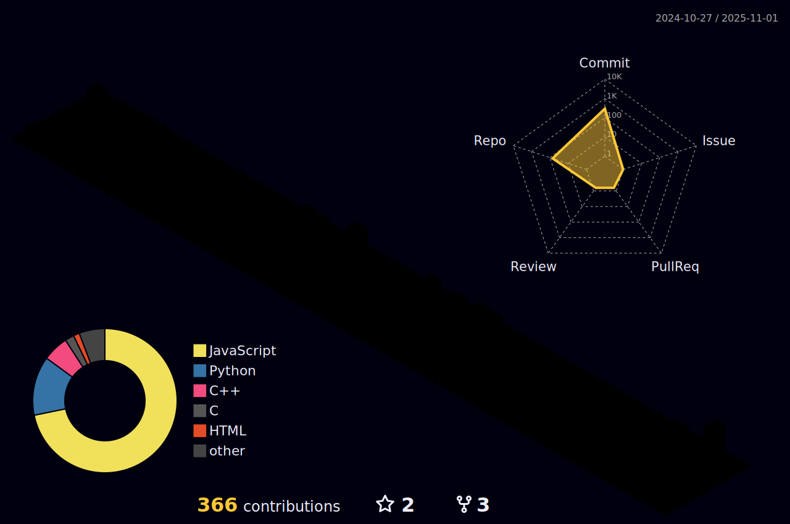

<!-- 1. 打字机效果 (适配：深色用浅蓝字，浅色用深蓝字) -->
<a href="https://github.com/XCQ0607">
  <picture>
    <source media="(prefers-color-scheme: dark)" srcset="https://down.nigx.cn/readme-typing-svg.herokuapp.com?font=Fira+Code&pause=1000&color=94A6FF&background=00000000&center=true&vCenter=true&width=435&lines=Hi+there!+I'm+XCQ0607;A+Student;A+Full+Stack+Developer;Open+Source+Enthusiast" />
    <source media="(prefers-color-scheme: light)" srcset="https://down.nigx.cn/readme-typing-svg.herokuapp.com?font=Fira+Code&pause=1000&color=0055AA&background=00000000&center=true&vCenter=true&width=435&lines=Hi+there!+I'm+XCQ0607;A+Student;A+Full+Stack+Developer;Open+Source+Enthusiast" />
    
  </picture>
</a>

<!-- 访客计数器 -->
 

 

<!-- 2. 3D Profile (适配：本地两张图切换) -->
<picture>
  <!-- 深色模式显示彩虹夜景 -->
  <source media="(prefers-color-scheme: dark)" srcset="./profile-3d-contrib/profile-night-rainbow.svg" />
  <!-- 亮色模式显示 gitblock -->
  <source media="(prefers-color-scheme: light)" srcset="./profile-3d-contrib/profile-gitblock.svg" />
  <!-- 默认显示 -->
  
</picture>

 

<!-- 3. Activity Graph (适配：保留国内加速) -->
<picture>
  <source media="(prefers-color-scheme: dark)" srcset="https://all.chinax.nyc.mn/github-readme-activity-graph.vercel.app/graph?username=XCQ0607&theme=tokyo-night" />
  <source media="(prefers-color-scheme: light)" srcset="https://all.chinax.nyc.mn/github-readme-activity-graph.vercel.app/graph?username=XCQ0607&theme=github-light" />
  
</picture>

 

<!-- 4. 贪吃蛇动画 (适配：注意 output 分支需有 dark 版) -->
<picture>
  <source media="(prefers-color-scheme: dark)" srcset="https://github.com/XCQ0607/XCQ0607/blob/output/github-contribution-grid-snake-dark.svg" />
  <source media="(prefers-color-scheme: light)" srcset="https://github.com/XCQ0607/XCQ0607/blob/output/github-contribution-grid-snake.svg" />
  
</picture>

<!-- 6. 核心数据统计 & 语言分布 (适配：gstarx 私有源) -->

  <picture>
    <source media="(prefers-color-scheme: dark)" srcset="https://all.chinax.nyc.mn/gstarx.vercel.app/api?username=XCQ0607&show_icons=true&theme=tokyonight&include_all_commits=true&locale=cn" />
    <source media="(prefers-color-scheme: light)" srcset="https://all.chinax.nyc.mn/gstarx.vercel.app/api?username=XCQ0607&show_icons=true&theme=transparent&include_all_commits=true&locale=cn&text_color=000" />
    
  </picture>
  <picture>
    <source media="(prefers-color-scheme: dark)" srcset="https://down.nigx.cn/gstarx.vercel.app/api/top-langs/?username=XCQ0607&layout=compact&theme=tokyonight&hide_border=true&locale=cn" />
    <source media="(prefers-color-scheme: light)" srcset="https://down.nigx.cn/gstarx.vercel.app/api/top-langs/?username=XCQ0607&layout=compact&theme=transparent&hide_border=true&locale=cn&text_color=000" />
    
  </picture>

<!-- 7. 连续打卡 Streak (适配：Streak Stats) -->
<picture>
  <source media="(prefers-color-scheme: dark)" srcset="https://all.chinax.nyc.mn/github-readme-streak-stats-eight.vercel.app/?user=XCQ0607&theme=tokyonight&hide_border=true&locale=zh_Hans" />
  <source media="(prefers-color-scheme: light)" srcset="https://all.chinax.nyc.mn/github-readme-streak-stats-eight.vercel.app/?user=XCQ0607&theme=default&hide_border=true&locale=zh_Hans" />
  
</picture>

<h3>🛠️ Tech Stack</h3>

<!-- 硬件与工具 -->

  
  
  

<!-- 编程语言 -->

  
  
  
  
  
  
  

<!-- 前端与框架 -->

  
  
  
  
  
  

<!-- 后端 -->

  

<h3>📫 Connect with me</h3>

  
  

